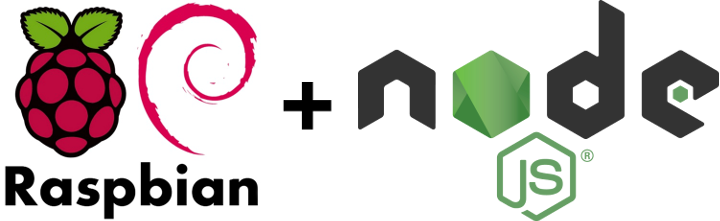

# projeto1
Projeto manipular Gpio da Raspberry Pi através de web service em NodeJS

 

  

Esse repositório é referente ao primeiro trabalho com Raspberry Pi da disciplina de tópicos de programação da faculdade de Engenharai de Software da PUC-Campinas.

Ele consiste em acender e apagar um LED em uma protoboard.

Usando node JS, foi possível instalar o pacote onoff que permite utilizar a Gpio da raspberry, desta forma foi feito no frontend um botão que ao ser acionado, faz a comunicação com o serviço criado no backend para acender o LED.

 

